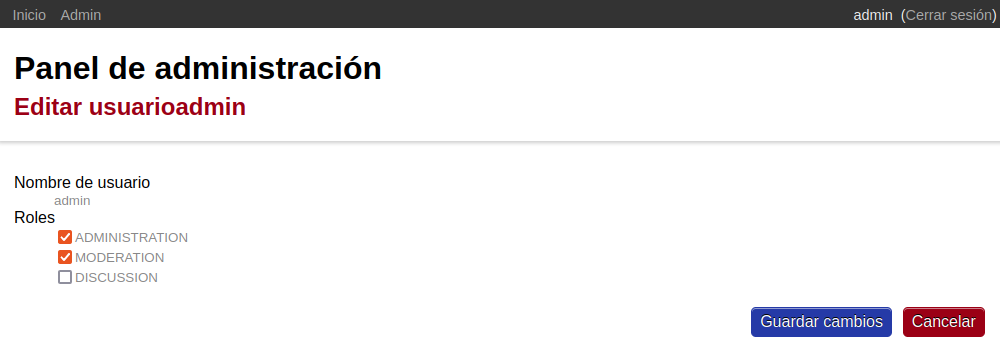
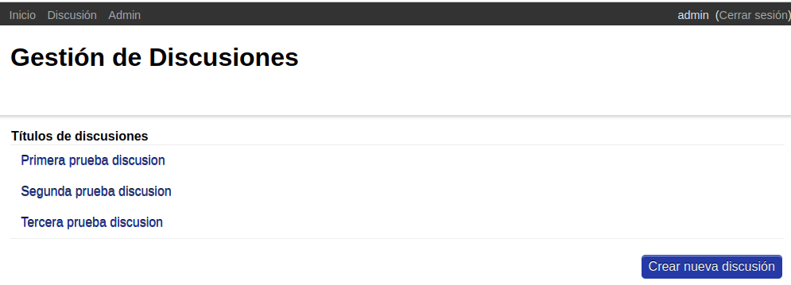

# DMS course project codebase, academic year 2022-2023

The goal of this project is to implement a basic questions and answers appliance deployed across several interconnected services.

## Autores
- Arturo Carretero Mateo
- Alvaro Díez Sáez
- Estela Victoria Ballester Delgado
- Baba Bendermel Houssam Eddine

## Manual de instalación
Para realizar el proceso de instalación en el equipo es necesario descargarlo de github a través de la ventana principal del repositorio. Para descargarlo se debe
clicar en "Code" y posteriormente en "Download ZIP".

Una vez se haya descargado el archivo es necesario descomprimir dicho archivo para las posteriores ejecuciones en el terminal.

## Manual de uso
- [Manual](#Manual)
  - [Discusion](#Discusion)
    - [Ver listado de preguntas](#Ver-listado-de-preguntas)
    - [Crear preguntas](#crear-preguntas)
    - [Crear respuestas a preguntas](#Crear-respuestas-a-preguntas)
    - [Crear comentarios a respuestas](#Crear-comentarios-a-respuestas)
    - [Votar respuestas y comentarios](#Votar-respuestas-y-comentarios)
    - [Reportar preguntas, respuestas y comentarios](#Reportar-preguntas-respuestas-y-comentarios)
  - [Moderador](#moderador)
    - [Ver pregunta individual](#Ver-pregunta-individual)
    - [Ver listado de reportes y resolverlos](#Ver-listado-de-reportes-y-resolverlos)
    - [Ocultar preguntas al aceptar reportes](#Ocultar-preguntas-al-aceptar-reportes)
  - [Creación de nuevos usuarios](#creación-de-nuevos-usuarios)

## Manual
Para la primera entega teniendo en cuenta que sera solo la parte del front-end tendremos la siguientes funcionalidades siendo el usuario "admin".
<br>Segun accedemos a nuestro servidor con la direccion "172.10.1.30" tendremos el siguiente login:

Accederemos con la contraseña y usuario "admin - admin".
<br>Una vez dentro , para poder interactuar como si fuesemos otro usuario tendremos que ir al apartado de gestion de usuarios.

En el panel de administración podremos modificar nuestro rol permitiendo acceder al de discusión y moderador pudiendo hacer sus acciones segun el rol,
también podremos crear nuevos usuarios.

Guardamos para continuar.
## Discusion
Accederemos Discucionn, teniendo acceso a sus posibilidades y vistas atraves de la barra superior.

Una vez en discusión podremos ver que tendremos acceso a las discusiones 

### Ver listado de discusiones
Una vez en las discusiones vemos que tenemos acceso a la lista de discusiones, ademas de crear preguntas.

### Crear discusion
Podremos crear la discusión que estará formada por el titulo y el contenido de este , al guardar los cambios esta pregunta pasara a formar parte del listado.

### Crear respuestas a preguntas 
Accediendo a las diferentes discusiones podremos crear las respuestas y comentarios , además de votarlos según el feedback que le queramos dar y reportarlos.

## Moderador
A continuacion cambiaremos el rol a moderador 

Accemos a las funcionalidades y vistas de moderador.

Tendremos acceso tanto a los reportes en la sección de informes y a la discussiones 

En el apartado de discusiones podremos ver un listado de las discusiones actuales
<br>Podremos acceder a cada una de ellas de manera individual.!

### Ver pregunta individual
Podremos ver la pregunta de manera individual pero sin ciertas funcionalidades disponibles como la de votar, reportar , etc ..

### Ver listado de reportes y resolverlos
En el apartado de informes del moderador tendremos acceso a la lista de reportes 

Accediendo a uno de ellos de forma individual podremos resolverlos 

Al aceptar el reporte ocultaremos las discusiones al resto de los usuarios.
## Creación de nuevos usuarios
Para la creacion de nuevos usuarios accederemos al apartado de admin en la barra superior.
<br>Seguidamente accederemos a la parte de gestion de usuarios.

Una vez ahi tendremos la posibilidad de crear usuarios

Para poder crear el usuario tendremos que poner su nombre y contraseña nueva 

Una vez que lo hemos creado lo editaremmos para asignar su correspondiente rol

Aqui podremos cambiar el rol del usuario procediendo a guardar los cambios.


## Frontend

### Arquitectura
La arquitectura de la página web es una arquitectura multicapa ya que esta se encuentra dividida en diferentes capas apiladas de las distintas estructuras de diseño.
De esta forma se busca el objetivo de reducir las dependencias de forma coherente.

La arquitectura empleada es la conocida como Documento-Vista por lo que el frontend dispone de dos capas: capa de presentación y capa de origen de datos.

La capa de presentación se encarga de la gestión de la interacción entre el cliente y el sofware. En este caso la capa se encuentra en: dms2223frontend/dms2223frontend/presentation

Las diferentes capas de presentación implementan las funcionalidades los distintos endpoints existentes: adminendpoints.py, commonendpoints.py, discussionendpoints.py, moderatorendpoints.py, sessionendpoints.py. Estos se encargan de realizar las llamadas a los distintos métodos necesarias para la obtención de datos y su posterior comunicación.

La capa de origen de datos se encarga de la gestión de la comunicación con otros sistemas que contiene datos que usa la aplicación. En este caso la capa se encuentra en: dms2223frontend/dms2223frontend/data

En esta capa se encuentran los servicios authservice.py y backendservice.py que se encargan de la obtención de datos pertenecientes a otros servicios.

### Patrones de diseño
Para la obtención de un buen diseño del software se han usado varios principios pertenecientes a los principios SOLID: Single Responsibility y Interface Segregation.
El principio Single Responsibility considera que una clase solo debería tener una razón para cambiar y el principio Interface Segregation considera que el usuario no debería depender de métodos que no usa.

En este caso estos principios se ven reflejados en las distintas clases ya que solamente mantienen las responsbilidades necesarias de cada uno dependiendo solo de los métodos y clases necesarios para el manejo. Los endpoints están organizados de forma que cada uno se encarga solamente de su respectiva responsabilidad. 

## Components

The source code of the components is available under the `components` directory.

### Services

The services comprising the appliance are:

#### `dms2223auth`

This is the authentication service. It provides the user credentials and rights functionalities of the application.

See the `README.md` file for further details on the service.

#### `dms2223backend`

This service provides the Q&A logic (definition of questions, answers/comments, etc.)

See the `README.md` file for further details on the service.

#### `dms2223frontend`

A frontend web service that allows to interact with the other services through a web browser.

See the `README.md` file for further details on the application.

### Libraries

These are auxiliar components shared by several services.

#### `dms2223core`

The shared core functionalities.

See the `README.md` file for further details on the component.

## Docker

The application comes with a pre-configured Docker setup to help with the development and testing (though it can be used as a base for more complex deployments).

To run the application using Docker Compose (`-d` "detaches" the standard I/O from the containers; i.e., they are run in background mode):

```bash
docker-compose -f docker/config/dev.yml up -d
```

When run for the first time, the required Docker images will be built. Should images be rebuilt, do it with:

```bash
docker-compose -f docker/config/dev.yml build
```

To stop and remove the containers:

```bash
docker-compose -f docker/config/dev.yml rm -sfv
```

By default data will not be persisted across executions. The configuration file `docker/config/dev.yml` can be edited to mount persistent volumes and use them for the persistent data.

To see the output of a container:

```bash
docker logs CONTAINER_NAME
# To keep printing the output as its streamed until interrupted with Ctrl+C:
# docker logs CONTAINER_NAME -f
```

To enter a running service as another subprocess to operate inside through a terminal:

```bash
docker exec -it CONTAINER_NAME /bin/bash
```

To see the status of the different containers:

```bash
docker container ps -a
```

## Helper scripts

The directory `scripts` contain several helper scripts.

- `verify-style.sh`: Runs linting (using pylint) on the components' code. This is used to verify a basic code quality. On GitHub, this CI pass will fail if the overall score falls below 7.00.
- `verify-type-correctness.sh`: Runs mypy to assess the type correctness in the components' code. It is used by GitHub to verify that no typing rules are broken in a commit.
- `verify-commit.sh`: Runs some validations before committing a changeset. Right now enforces type correctness (using `verify-type-correctness.sh`). Can be used as a Git hook to avoid committing a breaking change:
  Append at the end of `.git/hooks/pre-commit`:

  ```bash
  scripts/verify-commit.sh
  ```

## GitHub workflows and badges

This project includes some workflows configured in `.github/workflows`. They will generate the badges seen at the top of this document, so do not forget to update the URLs in this README file if the project is forked!
